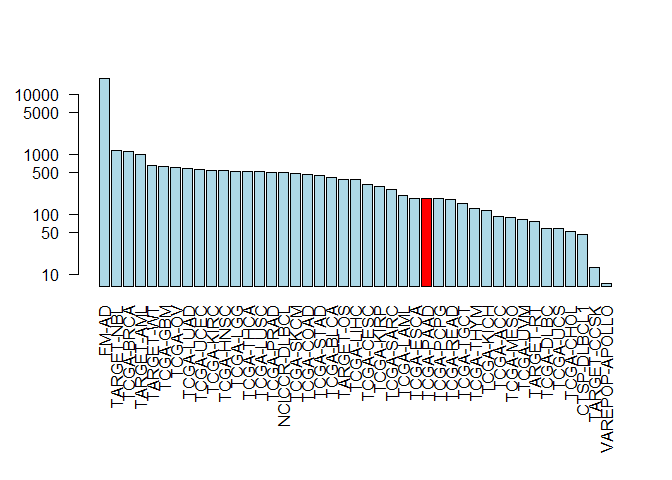
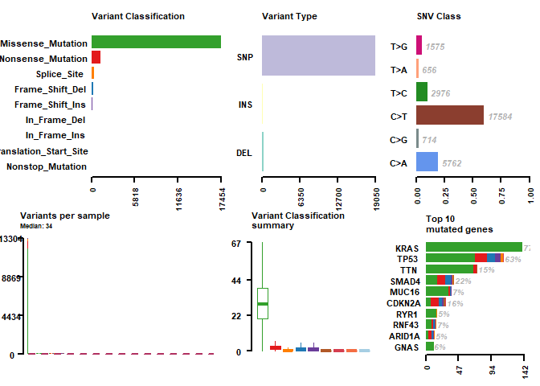
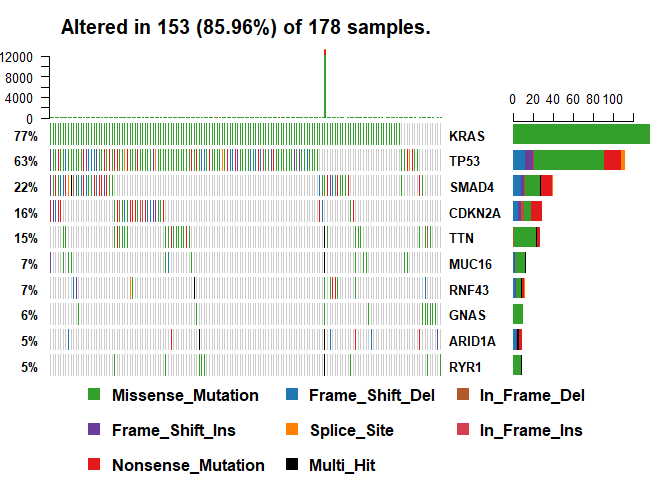
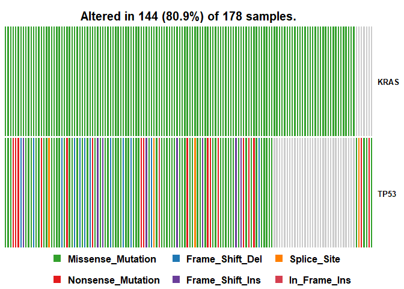
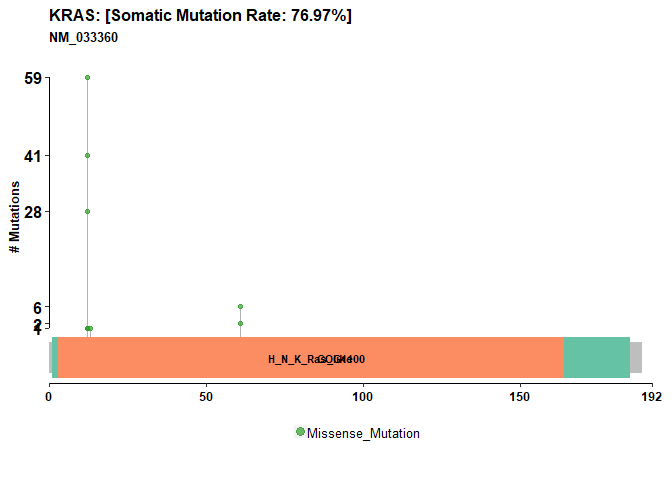
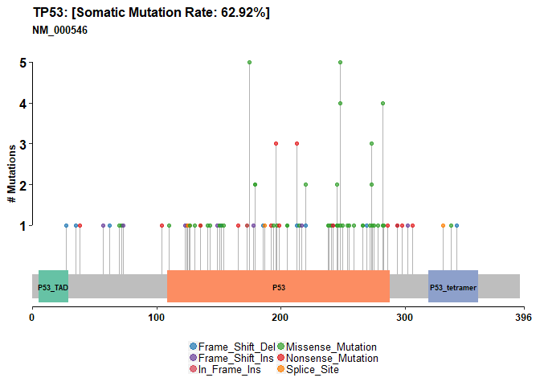

Class17
================

Cancer Genomics
===============

Installed and load the packages
-------------------------------

``` r
#source("https://bioconductor.org/biocLite.R")
#biocLite(c("GenomicDataCommons", "maftools"))
library(GenomicDataCommons)
```

    ## Loading required package: magrittr

    ## 
    ## Attaching package: 'GenomicDataCommons'

    ## The following object is masked from 'package:stats':
    ## 
    ##     filter

``` r
library(maftools)
```

Check on GDC status
-------------------

``` r
GenomicDataCommons::status()
```

    ## $commit
    ## [1] "acaf65369f6cea8337c6b59f0888761c9ed34654"
    ## 
    ## $data_release
    ## [1] "Data Release 13.0 - September 27, 2018"
    ## 
    ## $status
    ## [1] "OK"
    ## 
    ## $tag
    ## [1] "1.17.1"
    ## 
    ## $version
    ## [1] 1

``` r
cases_by_project <- cases() %>%
  facet("project.project_id") %>%
  aggregations()
head(cases_by_project)
```

    ## $project.project_id
    ##               key doc_count
    ## 1           FM-AD     18004
    ## 2      TARGET-NBL      1127
    ## 3       TCGA-BRCA      1098
    ## 4      TARGET-AML       988
    ## 5       TARGET-WT       652
    ## 6        TCGA-GBM       617
    ## 7         TCGA-OV       608
    ## 8       TCGA-LUAD       585
    ## 9       TCGA-UCEC       560
    ## 10      TCGA-KIRC       537
    ## 11      TCGA-HNSC       528
    ## 12       TCGA-LGG       516
    ## 13      TCGA-THCA       507
    ## 14      TCGA-LUSC       504
    ## 15      TCGA-PRAD       500
    ## 16   NCICCR-DLBCL       489
    ## 17      TCGA-SKCM       470
    ## 18      TCGA-COAD       461
    ## 19      TCGA-STAD       443
    ## 20      TCGA-BLCA       412
    ## 21      TARGET-OS       381
    ## 22      TCGA-LIHC       377
    ## 23      TCGA-CESC       307
    ## 24      TCGA-KIRP       291
    ## 25      TCGA-SARC       261
    ## 26      TCGA-LAML       200
    ## 27      TCGA-ESCA       185
    ## 28      TCGA-PAAD       185
    ## 29      TCGA-PCPG       179
    ## 30      TCGA-READ       172
    ## 31      TCGA-TGCT       150
    ## 32      TCGA-THYM       124
    ## 33      TCGA-KICH       113
    ## 34       TCGA-ACC        92
    ## 35      TCGA-MESO        87
    ## 36       TCGA-UVM        80
    ## 37      TARGET-RT        75
    ## 38      TCGA-DLBC        58
    ## 39       TCGA-UCS        57
    ## 40      TCGA-CHOL        51
    ## 41    CTSP-DLBCL1        45
    ## 42    TARGET-CCSK        13
    ## 43 VAREPOP-APOLLO         7

Barplot of the cases per project. Log scale for the y axis (log="y"), rotated axis labels (las=2) and color the bar coresponding to the TCGA-PAAD project.
----------------------------------------------------------------------------------------------------------------------------------------------------------

``` r
x <- cases_by_project$project.project_id

# Make a custom color vector for our plot
colvec <- rep("lightblue", nrow(x))

colvec[x$key == 'TCGA-PAAD'] <- "red"

# Plot with 'log' for y axis and rotate labels with 'las'
par(mar = c(10, 4, 4, 2) + 0.1)  
barplot(x$doc_count, names.arg=x$key, log='y', col=colvec, las=2)
```



Find all gene expression data files for all pancreatic cancer patients
----------------------------------------------------------------------

``` r
# This code snipet is taken from the package vignette
file_records <- files() %>%
  filter(~ cases.project.project_id == "TCGA-PAAD" &
    data_type == "Gene Expression Quantification" &
    analysis.workflow_type == "HTSeq - Counts") %>%
  response_all()
```

``` r
#View(file_records)
# Number of rows of RNA-Seq data from the ‘TCGA-PAAD’ project
nrow(file_records$results)
```

    ## [1] 182

Find MAF format somatic mutation files for our ‘TCGA-PAAD’ project. Focus on only one of the MAF files for this project in GDC, namely the MuTect2 workflow variant calls
-------------------------------------------------------------------------------------------------------------------------------------------------------------------------

``` r
maf.files = files() %>%
    filter(~ cases.project.project_id == 'TCGA-PAAD' &
        data_type == 'Masked Somatic Mutation' &
        data_format == "MAF" &
        analysis.workflow_type == "MuTect2 Variant Aggregation and Masking"
    ) %>%
    response_all()
```

``` r
#View(maf.files)
attributes(maf.files)
```

    ## $names
    ## [1] "results"      "query"        "pages"        "aggregations"
    ## 
    ## $class
    ## [1] "GDCfilesResponse" "GDCResponse"      "list"

Use the ids() function to pull out the unique identifier for our MAF file
-------------------------------------------------------------------------

``` r
uid <- ids(maf.files)
uid
```

    ## [1] "fea333b5-78e0-43c8-bf76-4c78dd3fac92"

``` r
#maffile = gdcdata(uid, destination_dir =".")
maffile = gdcdata(uid)

maffile
```

    ##                                                                                                                                                                fea333b5-78e0-43c8-bf76-4c78dd3fac92 
    ## "C:\\Users\\chinm\\AppData\\Local\\GenomicDataCommons\\GenomicDataCommons\\Cache/fea333b5-78e0-43c8-bf76-4c78dd3fac92/TCGA.PAAD.mutect.fea333b5-78e0-43c8-bf76-4c78dd3fac92.DR-10.0.somatic.maf.gz"

``` r
vars = read.maf(maf = maffile, verbose = FALSE)

plotmafSummary(maf =vars, rmOutlier = TRUE,
               addStat = 'median', dashboard = TRUE,
               titvRaw = FALSE)
```



``` r
oncoplot(maf = vars, top = 10)
```



``` r
# Oncoplot for our top 10 most frequently mutated genes
pdf("oncoplot_panc.pdf")
oncoplot(maf = vars, top = 10, fontSize = 12)
dev.off()
```

    ## png 
    ##   2

``` r
oncostrip(maf=vars, genes=c("KRAS", "TP53"))
```



``` r
lollipopPlot(maf = vars, gene = 'KRAS', 
                         showMutationRate = TRUE, domainLabelSize = 3)
```

    ## Assuming protein change information are stored under column HGVSp_Short. Use argument AACol to override if necessary.

    ## 2 transcripts available. Use arguments refSeqID or proteinID to manually specify tx name.

    ##    HGNC refseq.ID protein.ID aa.length
    ## 1: KRAS NM_004985  NP_004976       188
    ## 2: KRAS NM_033360  NP_203524       189

    ## Using longer transcript NM_033360 for now.



``` r
lollipopPlot(maf = vars, gene = 'TP53')
```

    ## Assuming protein change information are stored under column HGVSp_Short. Use argument AACol to override if necessary.

    ## 8 transcripts available. Use arguments refSeqID or proteinID to manually specify tx name.

    ##    HGNC    refseq.ID   protein.ID aa.length
    ## 1: TP53    NM_000546    NP_000537       393
    ## 2: TP53 NM_001126112 NP_001119584       393
    ## 3: TP53 NM_001126118 NP_001119590       354
    ## 4: TP53 NM_001126115 NP_001119587       261
    ## 5: TP53 NM_001126113 NP_001119585       346
    ## 6: TP53 NM_001126117 NP_001119589       214
    ## 7: TP53 NM_001126114 NP_001119586       341
    ## 8: TP53 NM_001126116 NP_001119588       209

    ## Using longer transcript NM_000546 for now.


