Class 5
================
chinm
Thu Nov 01 11:52:31 2018

``` r
# 2A Line Plots

# Baby weight input data
weight <-
  read.table("bimm143_05_rstats/weight_chart.txt", header = TRUE)

# View baby weight data as a table
View (weight)

# Make a line plot of the baby weights
plot(
  weight,
  pch = 4,
  typ = "b",
  col = "blue",
  main = "Baby weight over time",
  xlab = "Age (Months)",
  ylab = "Weight (kg)"
)
```

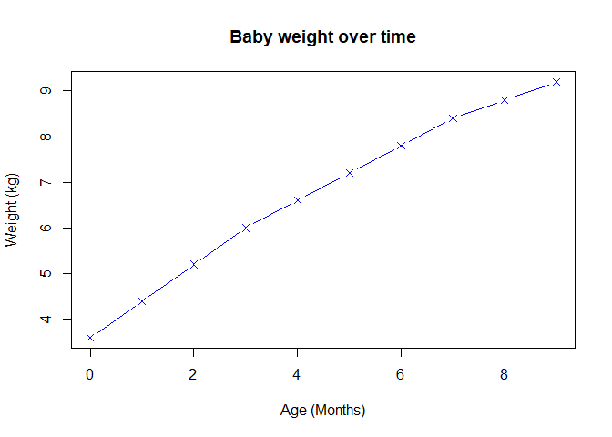

``` r
#2B Bar Plots

# Molecular elements input data

counts <-
  read.delim("bimm143_05_rstats/feature_counts.txt",
             header = TRUE)

# View molecular elements as a table
View (counts)

# Make bar plot of molecular elements
par (mar = c(5, 12, 4, 7))
par (mgp = c(3, 1, 0.5))
barplot(
  counts$Count,
  pch = 4,
  col = "green",
  main = "Number of Features in the mouse GRCm38 Genome",
  horiz = TRUE,
  density = 50,
  angle = 45,
  names.arg = counts$Feature,
  las = 1,
  xlim = c(0, 80000)
)
```

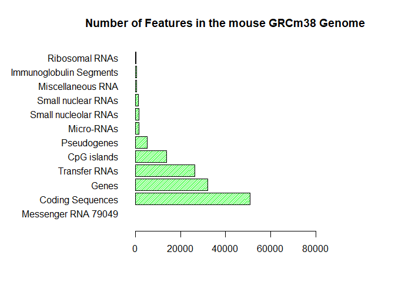

``` r
#2C Histograms

x <- c(rnorm(10000), rnorm(10000) + 4)
hist(x, breaks = 80)
```

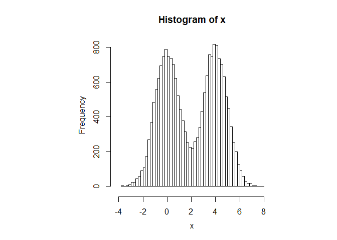

``` r
plot(c(1:10) ^ 2,
     typ = "b",
     lwd = 4,
     lty = 1)
```

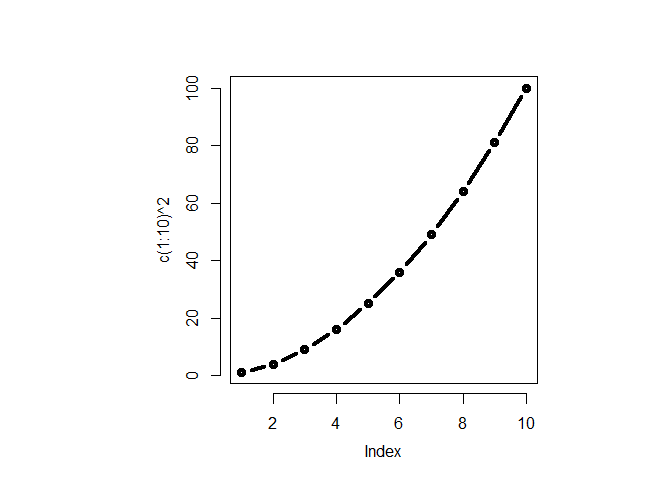

``` r
# 3A Providing color vectors

# Male and Female Counts input data
mf_counts <-
  read.table("bimm143_05_rstats/male_female_counts.txt",
             header = TRUE,
             sep = "\t")

# View male and female counts
View (mf_counts)

# Make bar plot of male and female counts
par (mar = c(7, 4, 4, 4))
par (mgp = c(3, 1, 0.5))
r <- rainbow(nrow(mf_counts))
barplot(
  mf_counts$Count,
  pch = 4,
  col = r,
  names.arg = mf_counts$Sample,
  las = 2
)
```

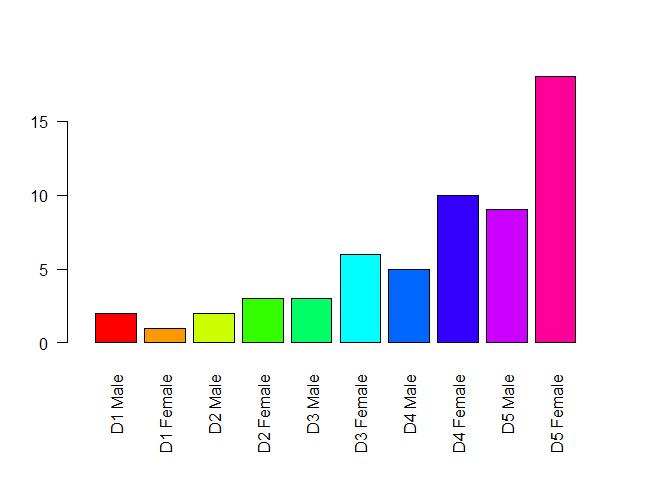

``` r
barplot(
  mf_counts$Count,
  pch = 4,
  col = c("red", "blue"),
  names.arg = mf_counts$Sample,
  las = 2
)
```

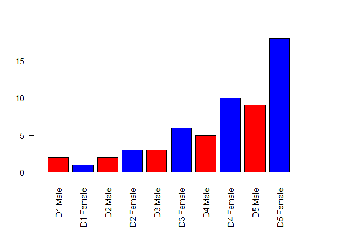

``` r
# 3B Providing color vectors

# Up and Down input data
genes <-
  read.table("bimm143_05_rstats/up_down_expression.txt",
             header = TRUE,
             sep = "\t")

# View male and female counts
View (genes)

# Number of Rows
nrow(genes)
```

    ## [1] 5196

``` r
# Number of genes that are up/down/unchanging
table (genes$State)
```

    ## 
    ##       down unchanging         up 
    ##         72       4997        127

``` r
# Scatterplot of genes
plot (
  genes$Condition1,
  genes$Condition2,
  col = genes$State,
  xlab = "Expression Condition 1",
  ylab = "Expression Condition 2"
)
```

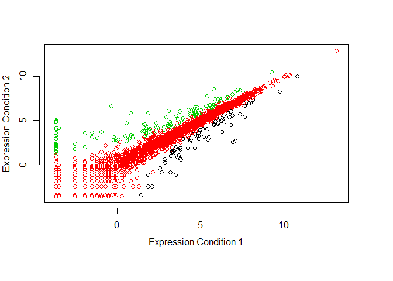

``` r
# Adjust color scheme for scatterplot of genes
palette(c("red", "gray", "green3"))
plot (
  genes$Condition1,
  genes$Condition2,
  col = genes$State,
  xlab = "Expression Condition 1",
  ylab = "Expression Condition 2"
)
```

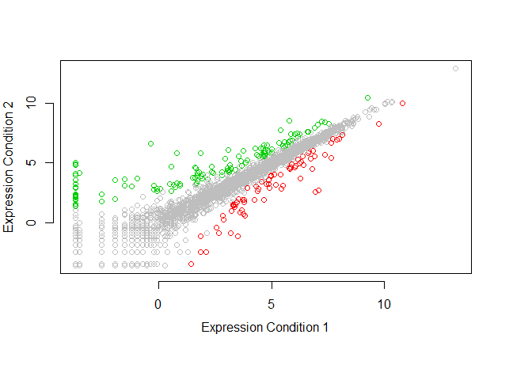

``` r
# 3C Dynamic Coloring

# Expression Methylation input data
meth <- read.delim("bimm143_05_rstats/expression_methylation.txt")

# View male and female counts
View (meth)

# Number of Rows
nrow(genes)
```

    ## [1] 5196

``` r
# Scatterplot of expression methylation genes
plot(meth$gene.meth, meth$expression)
```

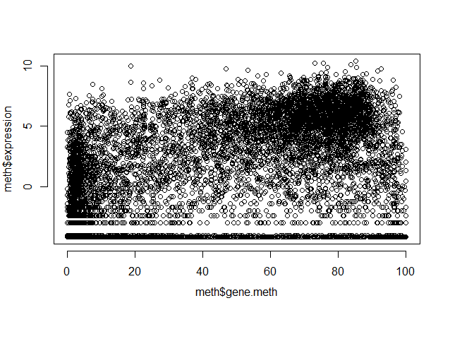

``` r
# Coloring by point density and making a new plot
dcols <- densCols(meth$gene.meth, meth$expression)
plot(meth$gene.meth,
     meth$expression,
     col = dcols,
     pch = 20)
```

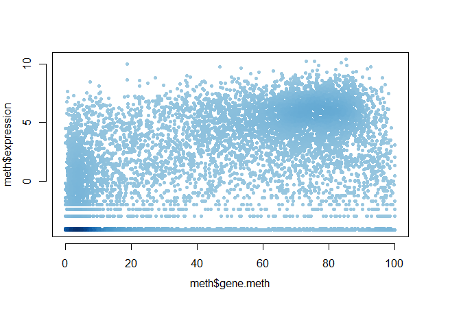

``` r
# Trimming for data that has more than 0 gene expression and making a new plot
inds <- meth$expression > 0
plot(meth$gene.meth[inds], meth$expression[inds])
```

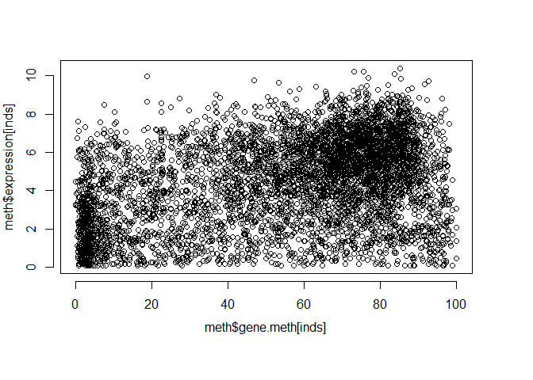

``` r
# Coloring by point density for trimmed data and making a new plot
dcols2 <- densCols(meth$gene.meth[inds], meth$expression[inds])
plot(meth$gene.meth[inds],
     meth$expression[inds],
     col = dcols2,
     pch = 20)
```

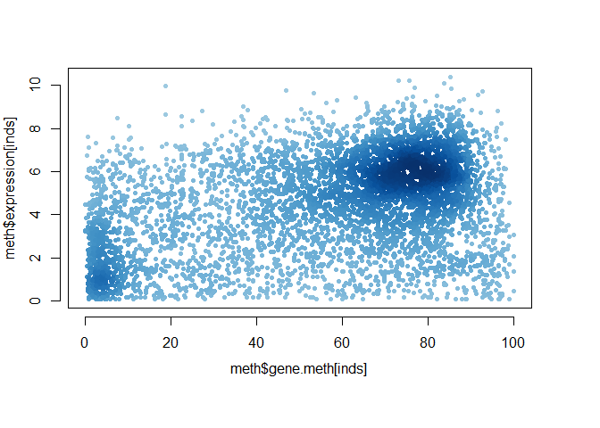

``` r
# Custom coloring by point density
dcols.custom <-
  densCols(meth$gene.meth[inds], meth$expression[inds], colramp = colorRampPalette(c("blue2", "green2", "red2", "yellow")))
plot(meth$gene.meth[inds],
     meth$expression[inds],
     col = dcols.custom,
     pch = 20)
```

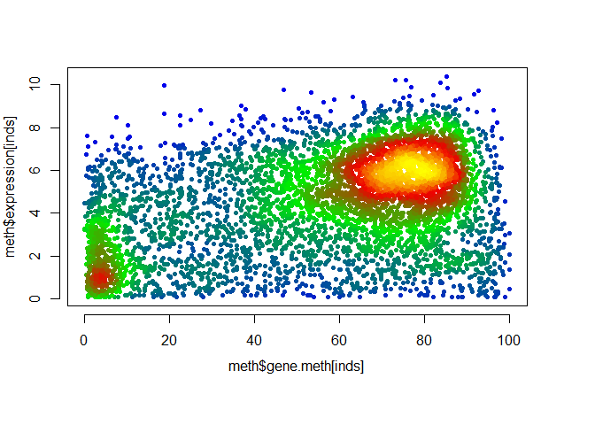
