Class 8
================
Chinmay Kalluraya
October 25, 2018

K-means clustering
------------------

#### Our first example with **k-means()** function

``` r
# Generate some example data for clustering
tmp <- c(rnorm(30,-3), rnorm(30,3))
x <- cbind(x=tmp, y=rev(tmp))
plot(x)
```

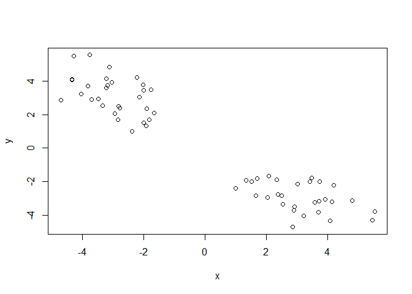 \# Use the kmeans() function setting k to 2 and nstart=20

``` r
cl1 <- kmeans(x, center = 2, nstart = 20)
```

Inspect/print the results
=========================

Q. How many points are in each cluster?
=======================================

``` r
cl1$size
```

    ## [1] 30 30

Q. What ‘component’ of your result object details
=================================================

- cluster size?
===============

``` r
cl1$size
```

    ## [1] 30 30

- cluster assignment/membership?
================================

``` r
cl1$cluster
```

    ##  [1] 1 1 1 1 1 1 1 1 1 1 1 1 1 1 1 1 1 1 1 1 1 1 1 1 1 1 1 1 1 1 2 2 2 2 2
    ## [36] 2 2 2 2 2 2 2 2 2 2 2 2 2 2 2 2 2 2 2 2 2 2 2 2 2

- cluster center?
=================

``` r
cl1$center
```

    ##           x         y
    ## 1 -2.955296  3.133713
    ## 2  3.133713 -2.955296

Plot x colored by the kmeans cluster assignment and
===================================================

add cluster centers as blue points
==================================

``` r
palette(c("red", "green"))
plot (x, col = cl1$cluster)
points(cl1$centers, col = "blue", pch=20, cex = 2)
```

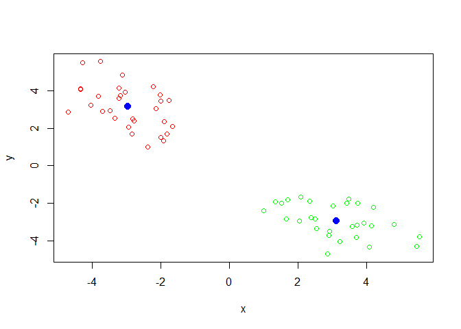

Q. Repeat for k=3, which has the lower tot.withinss?
====================================================

``` r
cl2 <- kmeans(x, center = 2, nstart = 20)
cl3 <- kmeans(x, center = 3, nstart = 20)
cl4 <- kmeans(x, center = 4, nstart = 20)
cl5 <- kmeans(x, center = 5, nstart = 20)

scree = (c(cl2$tot.withinss, cl3$tot.withinss, cl4$tot.withinss, cl5$tot.withinss))
plot(scree, typ="b", main = "scree")
```

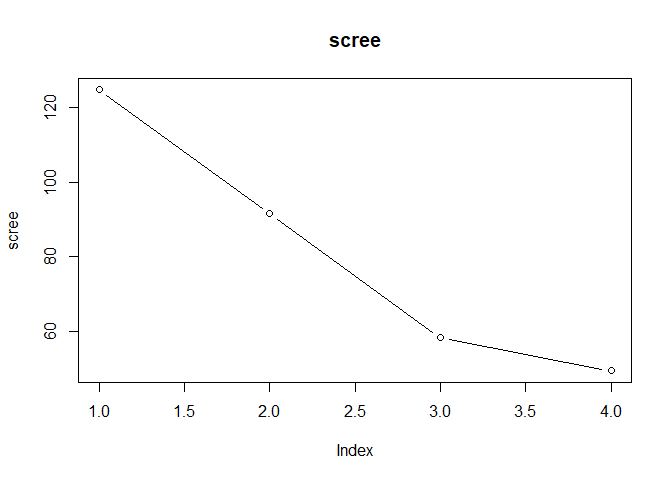

Heirarchial Clustering in R
---------------------------

#### Let's try out the **hclust()** function for Heirarchial clustering in R. This function needs a distance matrix as input.

``` r
d <- dist (x)
hc <- hclust(d)
plot(hc)
abline (h=8, col = "red")
```

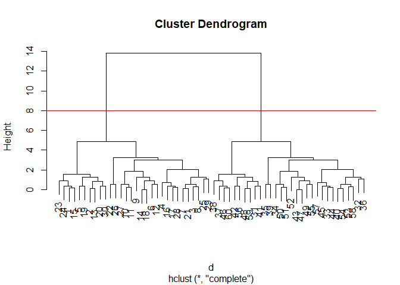

``` r
cutree(hc, h=8)
```

    ##  [1] 1 1 1 1 1 1 1 1 1 1 1 1 1 1 1 1 1 1 1 1 1 1 1 1 1 1 1 1 1 1 2 2 2 2 2
    ## [36] 2 2 2 2 2 2 2 2 2 2 2 2 2 2 2 2 2 2 2 2 2 2 2 2 2

Step 1. Generate some example data for clustering
=================================================

``` r
x <- rbind(
 matrix(rnorm(100, mean=0, sd = 0.3), ncol = 2), # c1
 matrix(rnorm(100, mean = 1, sd = 0.3), ncol = 2), # c2
 matrix(c(rnorm(50, mean = 1, sd = 0.3), # c3
 rnorm(50, mean = 0, sd = 0.3)), ncol = 2))
colnames(x) <- c("x", "y")
```

Step 2. Plot the data without clustering
========================================

``` r
plot(x)
```

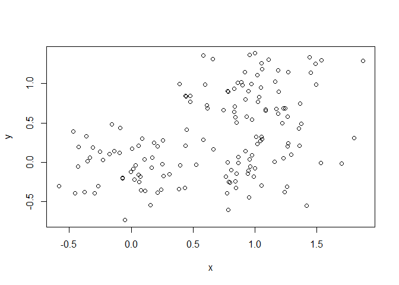

Step 3. Generate colors for known clusters
==========================================

(just so we can compare to hclust results)
==========================================

``` r
col <- as.factor( rep(c("c1","c2","c3"), each=50) )
palette(c("red", "blue", "black"))
plot(x, col=col, pch = 20)
```

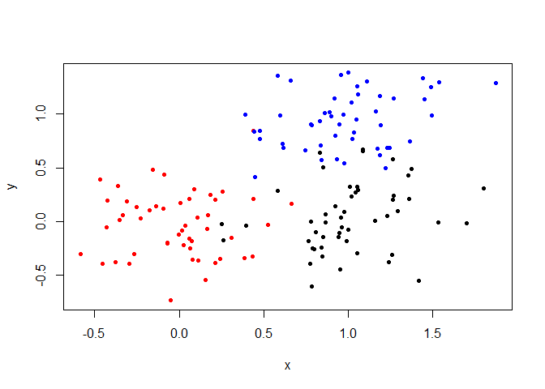

Q. Use the dist(), hclust(), plot() and cutree()
================================================

functions to return 2 and 3 clusters
====================================

``` r
d <- dist (x)
hc <- hclust(d)
plot(hc)
```

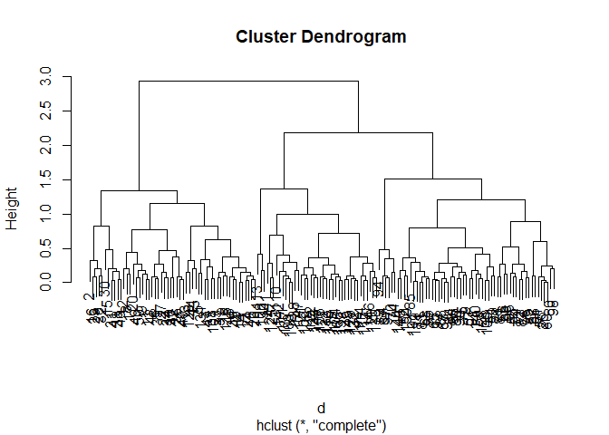

``` r
clus3 <- cutree(hc, k=3)
clus2 <- cutree(hc, k=2)
plot(x, col = clus3, pch = 20)
```

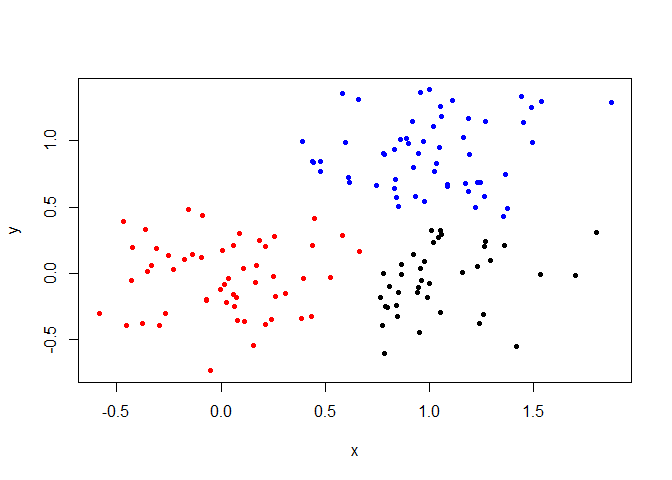

``` r
plot(x, col = clus2, pch = 20)
```

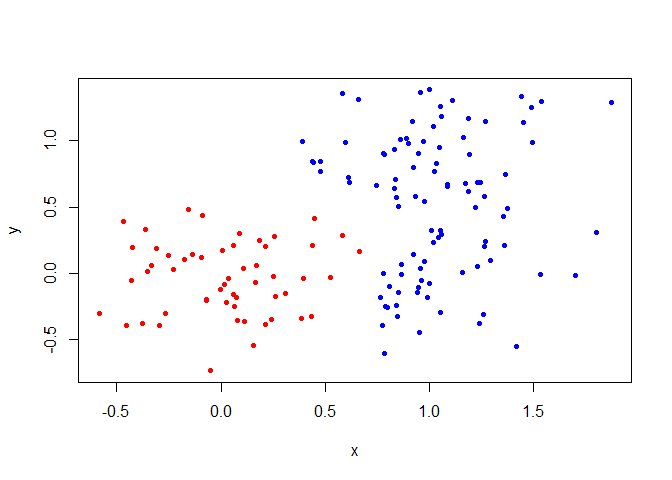

Q. How does this compare to your known 'col' groups?
====================================================

``` r
table(clus3, col)
```

    ##      col
    ## clus3 c1 c2 c3
    ##     1 49  1  4
    ##     2  1 49  7
    ##     3  0  0 39

``` r
table(clus2, col)
```

    ##      col
    ## clus2 c1 c2 c3
    ##     1 49  1  4
    ##     2  1 49 46

Prinipal component analysis
---------------------------

``` r
## Initialize a blank 100 row by 10 column matrix
mydata <- matrix(nrow=100, ncol=10)

## Lets label the rows gene1, gene2 etc. to gene100
rownames(mydata) <- paste("gene", 1:100, sep="") 

## Lets label the first 5 columns wt1, wt2, wt3, wt4 and wt5
## and the last 5 ko1, ko2 etc. to ko5 (for "knock-out")
colnames(mydata) <- c( paste("wt", 1:5, sep=""), 
                       paste("ko", 1:5, sep="") ) 

## Fill in some fake read counts
for(i in 1:nrow(mydata)) {
 wt.values <- rpois(5, lambda=sample(x=10:1000, size=1))
 ko.values <- rpois(5, lambda=sample(x=10:1000, size=1))

 mydata[i,] <- c(wt.values, ko.values)
}
head(mydata)
```

    ##       wt1 wt2 wt3 wt4 wt5 ko1 ko2 ko3 ko4 ko5
    ## gene1 461 476 509 497 443 180 190 186 162 168
    ## gene2 522 580 564 538 538 818 897 871 829 870
    ## gene3 484 605 498 529 545  83  84  98 106 112
    ## gene4 115 115 120 100 108 733 775 700 723 745
    ## gene5 937 939 902 978 934 859 860 926 923 903
    ## gene6 652 708 685 678 730 546 610 592 580 571

``` r
## Try to find structure in this data wth prcomp

## lets do PCA
pca <- prcomp(t(mydata), scale=TRUE)
## See what is returned by the prcomp() function
attributes(pca) 
```

    ## $names
    ## [1] "sdev"     "rotation" "center"   "scale"    "x"       
    ## 
    ## $class
    ## [1] "prcomp"

``` r
## A basic P1 vs PC2 2-D Plot

plot(pca$x[,1], pca$x[,2])
```

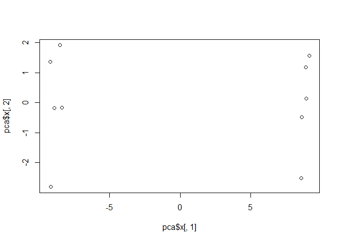

``` r
## Precent variance is often more informative to look at
pca.var <- pca$sdev^2
pca.var.per <- round(pca.var/sum(pca.var)*100, 1) 

## Make Scree Plot
barplot(pca.var.per, main="Scree Plot",
 xlab="Principal Component", ylab="Percent Variation")
```

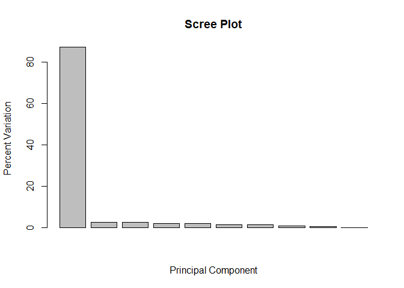

``` r
## A vector of colors for wt and ko samples
colvec <- colnames(mydata)
colvec[grep("wt", colvec)] <- "red"
colvec[grep("ko", colvec)] <- "blue"
plot(pca$x[,1], pca$x[,2], col=colvec, pch=16,
 xlab=paste0("PC1 (", pca.var.per[1], "%)"),
 ylab=paste0("PC2 (", pca.var.per[2], "%)")) 
```

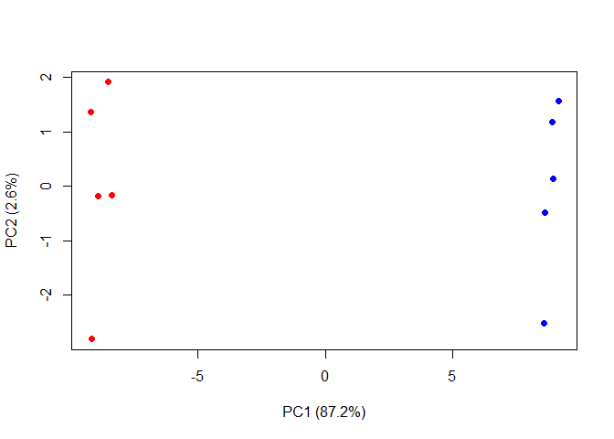

``` r
## Lets focus on PC1 as it accounts for > 90% of variance
loading_scores <- pca$rotation[,1]
summary(loading_scores) 
```

    ##      Min.   1st Qu.    Median      Mean   3rd Qu.      Max. 
    ## -0.107067 -0.106358 -0.016365 -0.001698  0.106127  0.106975

``` r
## We are interested in the magnitudes of both plus
## and minus contributing genes
gene_scores <- abs(loading_scores) 

## Sort by magnitudes from high to low
gene_score_ranked <- sort(gene_scores, decreasing=TRUE) 

## Find the names of the top 5 genes
top_5_genes <- names(gene_score_ranked[1:5])
## Show the scores (with +/- sign)
pca$rotation[top_5_genes,1]
```

    ##     gene52     gene74     gene20     gene67     gene54 
    ## -0.1070667 -0.1070541 -0.1069950 -0.1069768  0.1069749

``` r
## UK Food Data

x <- read.csv("UK_foods.csv")
dim(x)
```

    ## [1] 17  5

``` r
rownames(x) <- x[,1]
x <- x[,-1]
head(x)
```

    ##                England Wales Scotland N.Ireland
    ## Cheese             105   103      103        66
    ## Carcass_meat       245   227      242       267
    ## Other_meat         685   803      750       586
    ## Fish               147   160      122        93
    ## Fats_and_oils      193   235      184       209
    ## Sugars             156   175      147       139

``` r
dim(x)
```

    ## [1] 17  4

``` r
knitr::kable(x, caption="The full UK foods data table")
```

|                     |  England|  Wales|  Scotland|  N.Ireland|
|---------------------|--------:|------:|---------:|----------:|
| Cheese              |      105|    103|       103|         66|
| Carcass\_meat       |      245|    227|       242|        267|
| Other\_meat         |      685|    803|       750|        586|
| Fish                |      147|    160|       122|         93|
| Fats\_and\_oils     |      193|    235|       184|        209|
| Sugars              |      156|    175|       147|        139|
| Fresh\_potatoes     |      720|    874|       566|       1033|
| Fresh\_Veg          |      253|    265|       171|        143|
| Other\_Veg          |      488|    570|       418|        355|
| Processed\_potatoes |      198|    203|       220|        187|
| Processed\_Veg      |      360|    365|       337|        334|
| Fresh\_fruit        |     1102|   1137|       957|        674|
| Cereals             |     1472|   1582|      1462|       1494|
| Beverages           |       57|     73|        53|         47|
| Soft\_drinks        |     1374|   1256|      1572|       1506|
| Alcoholic\_drinks   |      375|    475|       458|        135|
| Confectionery       |       54|     64|        62|         41|

``` r
heatmap(as.matrix(x))
```

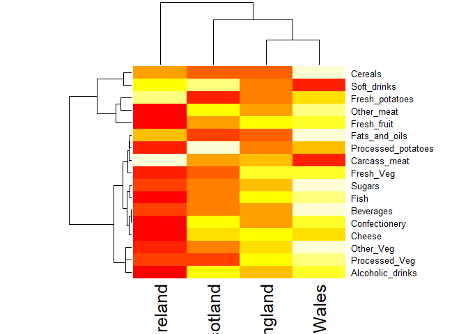

``` r
pca <- prcomp( t(x) )
summary(pca)
```

    ## Importance of components:
    ##                             PC1      PC2      PC3       PC4
    ## Standard deviation     324.1502 212.7478 73.87622 4.189e-14
    ## Proportion of Variance   0.6744   0.2905  0.03503 0.000e+00
    ## Cumulative Proportion    0.6744   0.9650  1.00000 1.000e+00

``` r
plot(pca$x[,1], pca$x[,2], xlab="PC1", ylab="PC2", xlim=c(-270,500))
text(pca$x[,1], pca$x[,2], colnames(x))
```


``` r
v <- round( pca$sdev^2/sum(pca$sdev^2) * 100 )
v
```

    ## [1] 67 29  4  0

``` r
z <- summary(pca)
z$importance
```

    ##                              PC1       PC2      PC3          PC4
    ## Standard deviation     324.15019 212.74780 73.87622 4.188568e-14
    ## Proportion of Variance   0.67444   0.29052  0.03503 0.000000e+00
    ## Cumulative Proportion    0.67444   0.96497  1.00000 1.000000e+00

``` r
barplot(v, xlab="Principal Component", ylab="Percent Variation")
```


