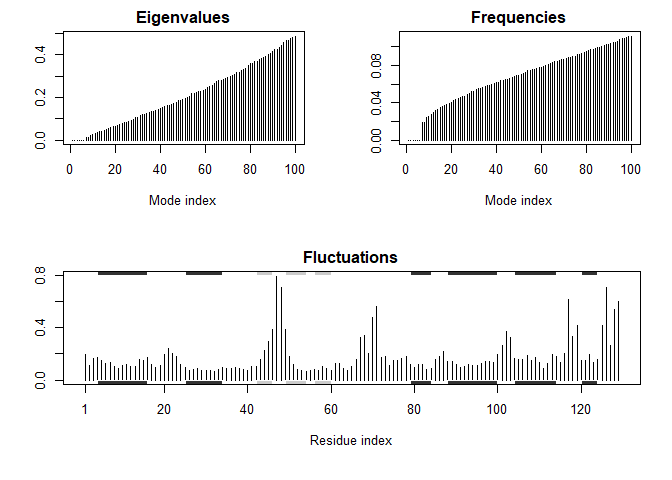

Class\_13: Structural Bioinformatics II
================
Chinmay Kalluraya
November 13, 2018

Get HIV-Pr structure from PDB database
--------------------------------------

``` r
library("bio3d")
file.name <- get.pdb("1hsg")
```

    ## Warning in get.pdb("1hsg"): ./1hsg.pdb exists. Skipping download

``` r
hiv <- read.pdb(file.name)
hiv
```

    ## 
    ##  Call:  read.pdb(file = file.name)
    ## 
    ##    Total Models#: 1
    ##      Total Atoms#: 1686,  XYZs#: 5058  Chains#: 2  (values: A B)
    ## 
    ##      Protein Atoms#: 1514  (residues/Calpha atoms#: 198)
    ##      Nucleic acid Atoms#: 0  (residues/phosphate atoms#: 0)
    ## 
    ##      Non-protein/nucleic Atoms#: 172  (residues: 128)
    ##      Non-protein/nucleic resid values: [ HOH (127), MK1 (1) ]
    ## 
    ##    Protein sequence:
    ##       PQITLWQRPLVTIKIGGQLKEALLDTGADDTVLEEMSLPGRWKPKMIGGIGGFIKVRQYD
    ##       QILIEICGHKAIGTVLVGPTPVNIIGRNLLTQIGCTLNFPQITLWQRPLVTIKIGGQLKE
    ##       ALLDTGADDTVLEEMSLPGRWKPKMIGGIGGFIKVRQYDQILIEICGHKAIGTVLVGPTP
    ##       VNIIGRNLLTQIGCTLNF
    ## 
    ## + attr: atom, xyz, seqres, helix, sheet,
    ##         calpha, remark, call

Slit into separate protein and ligand
-------------------------------------

``` r
prot <- trim.pdb(hiv, "protein")
lig <- trim.pdb(hiv, "ligand")
```

``` r
write.pdb(prot, file="1hsg_protein.pdb")
write.pdb(lig, file="1hsg_ligand.pdb")
```

Docking with Vina
-----------------

We run this command: `"\Program Files (x86)\The Scripps Research nstitute\Vina\vina.exe" --config config.txt --log log.txt`

Inspect Docking Results
-----------------------

``` r
res <- read.pdb("all.pdbqt", multi=TRUE)
write.pdb(res, "results.pdb")
```

RMSD
----

``` r
ori <- read.pdb("1hsg_ligand.pdbqt")
rmsd(ori, res)
```

    ##  [1]  0.649  4.206 11.110 10.529  4.840 10.932 10.993  3.655 10.996 11.222
    ## [11] 10.567 10.372 11.019 11.338  8.390  9.063  8.254  8.978

Normal Mode Analysis
--------------------

``` r
library(bio3d)
pdb <- read.pdb("1HEL")
```

    ##   Note: Accessing on-line PDB file

``` r
modes <- nma(pdb)
```

    ##  Building Hessian...     Done in 0.01 seconds.
    ##  Diagonalizing Hessian...    Done in 0.11 seconds.

``` r
plot(modes, sse=pdb)
```



``` r
# Visualize NMA results
mktrj(modes, mode=7, file="nma_7.pdb")
```
