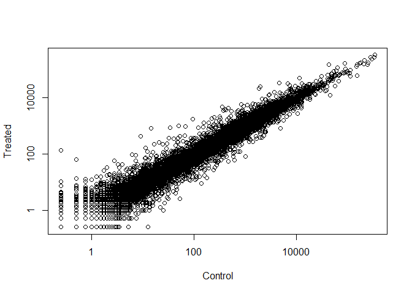

class15
================

RNA Seq Analysis
----------------

Install DESeq2 Bioconductor Package
===================================

``` r
#source("http://bioconductor.org/biocLite.R")
#biocLite()
# For this class, you'll also need DESeq2:
#biocLite("DESeq2")

library(BiocInstaller)
```

    ## Bioconductor version 3.7 (BiocInstaller 1.30.0), ?biocLite for help

    ## A newer version of Bioconductor is available for this version of R,
    ##   ?BiocUpgrade for help

Read countData and colData (metadata) files that we will use with DESeq
=======================================================================

``` r
counts <- read.csv("data/airway_scaledcounts.csv", stringsAsFactors = FALSE)
metadata <-  read.csv("data/airway_metadata.csv", stringsAsFactors = FALSE)
```

Examine metadata file to find control and treated columns (cell lines)
======================================================================

``` r
control.inds <- metadata$dex == "control"
control <- metadata[control.inds,]
#control
```

``` r
control.mean <- rowSums(counts[,control$id])/nrow(control)
names(control.mean) <- counts$ensgene
#control.mean
```

Do the same for the treated column
==================================

``` r
treated.inds <- metadata$dex == "treated"
treated <- metadata[treated.inds,]
#treated
treated.mean <- rowSums(counts[,treated$id])/nrow(treated)
names(treated.mean) <- counts$ensgene
#treated.mean
```

Combine meancount for bookkeeping purposes
==========================================

``` r
meancounts <- data.frame(control.mean,treated.mean)
colSums(meancounts)
```

    ## control.mean treated.mean 
    ##     23005324     22196524

Plot mean of the treated samples against the mean of the control samples with log transformation
================================================================================================

``` r
plot(meancounts$control.mean, meancounts$treated.mean, xlab = "Control", ylab = "Treated", log = "xy")
```

    ## Warning in xy.coords(x, y, xlabel, ylabel, log): 15032 x values <= 0
    ## omitted from logarithmic plot

    ## Warning in xy.coords(x, y, xlabel, ylabel, log): 15281 y values <= 0
    ## omitted from logarithmic plot



Log 2 fold change
=================

``` r
meancounts$log2fc <- log2(meancounts[,"treated.mean"]/meancounts[,"control.mean"])
head(meancounts)
```

    ##                 control.mean treated.mean      log2fc
    ## ENSG00000000003       900.75       658.00 -0.45303916
    ## ENSG00000000005         0.00         0.00         NaN
    ## ENSG00000000419       520.50       546.00  0.06900279
    ## ENSG00000000457       339.75       316.50 -0.10226805
    ## ENSG00000000460        97.25        78.75 -0.30441833
    ## ENSG00000000938         0.75         0.00        -Inf

Filter genes with zero expression
=================================

``` r
zero.vals <- which(meancounts[,1:2]==0, arr.ind=TRUE)

to.rm <- unique(zero.vals[,1])
mycounts <- meancounts[-to.rm,]
head(mycounts)
```

    ##                 control.mean treated.mean      log2fc
    ## ENSG00000000003       900.75       658.00 -0.45303916
    ## ENSG00000000419       520.50       546.00  0.06900279
    ## ENSG00000000457       339.75       316.50 -0.10226805
    ## ENSG00000000460        97.25        78.75 -0.30441833
    ## ENSG00000000971      5219.00      6687.50  0.35769358
    ## ENSG00000001036      2327.00      1785.75 -0.38194109

Filter the dataset for upregulated and downregulated (based on fold change +2/-2)
=================================================================================

``` r
up.ind <- mycounts$log2fc > 2
down.ind <- mycounts$log2fc < (-2)
```

Number of genes upregulated and downregulated
=============================================

``` r
sum(up.ind)
```

    ## [1] 250

``` r
sum(down.ind)
```

    ## [1] 367

Annotate the genes

``` r
anno <- read.csv("data/annotables_grch38.csv")
head(anno)
```

    ##           ensgene entrez   symbol chr     start       end strand
    ## 1 ENSG00000000003   7105   TSPAN6   X 100627109 100639991     -1
    ## 2 ENSG00000000005  64102     TNMD   X 100584802 100599885      1
    ## 3 ENSG00000000419   8813     DPM1  20  50934867  50958555     -1
    ## 4 ENSG00000000457  57147    SCYL3   1 169849631 169894267     -1
    ## 5 ENSG00000000460  55732 C1orf112   1 169662007 169854080      1
    ## 6 ENSG00000000938   2268      FGR   1  27612064  27635277     -1
    ##          biotype
    ## 1 protein_coding
    ## 2 protein_coding
    ## 3 protein_coding
    ## 4 protein_coding
    ## 5 protein_coding
    ## 6 protein_coding
    ##                                                                                                  description
    ## 1                                                          tetraspanin 6 [Source:HGNC Symbol;Acc:HGNC:11858]
    ## 2                                                            tenomodulin [Source:HGNC Symbol;Acc:HGNC:17757]
    ## 3 dolichyl-phosphate mannosyltransferase polypeptide 1, catalytic subunit [Source:HGNC Symbol;Acc:HGNC:3005]
    ## 4                                               SCY1-like, kinase-like 3 [Source:HGNC Symbol;Acc:HGNC:19285]
    ## 5                                    chromosome 1 open reading frame 112 [Source:HGNC Symbol;Acc:HGNC:25565]
    ## 6                          FGR proto-oncogene, Src family tyrosine kinase [Source:HGNC Symbol;Acc:HGNC:3697]

Merge datasets anno and mycounts
================================

``` r
mycounts.anno <- merge(mycounts,anno,by.x = 0, by.y = "ensgene")
View(mycounts.anno)
```

Bioconductor’s annotation packages help with mapping various ID schemes to each other. Here we load the AnnotationDbi package and the annotation package org.Hs.eg.db.
======================================================================================================================================================================

``` r
#biocLite("AnnotationDbi")
#biocLite("org.Hs.eg.db")
library("AnnotationDbi")
```

    ## Loading required package: stats4

    ## Loading required package: BiocGenerics

    ## Loading required package: parallel

    ## 
    ## Attaching package: 'BiocGenerics'

    ## The following objects are masked from 'package:parallel':
    ## 
    ##     clusterApply, clusterApplyLB, clusterCall, clusterEvalQ,
    ##     clusterExport, clusterMap, parApply, parCapply, parLapply,
    ##     parLapplyLB, parRapply, parSapply, parSapplyLB

    ## The following objects are masked from 'package:stats':
    ## 
    ##     IQR, mad, sd, var, xtabs

    ## The following objects are masked from 'package:base':
    ## 
    ##     anyDuplicated, append, as.data.frame, basename, cbind,
    ##     colMeans, colnames, colSums, dirname, do.call, duplicated,
    ##     eval, evalq, Filter, Find, get, grep, grepl, intersect,
    ##     is.unsorted, lapply, lengths, Map, mapply, match, mget, order,
    ##     paste, pmax, pmax.int, pmin, pmin.int, Position, rank, rbind,
    ##     Reduce, rowMeans, rownames, rowSums, sapply, setdiff, sort,
    ##     table, tapply, union, unique, unsplit, which, which.max,
    ##     which.min

    ## Loading required package: Biobase

    ## Welcome to Bioconductor
    ## 
    ##     Vignettes contain introductory material; view with
    ##     'browseVignettes()'. To cite Bioconductor, see
    ##     'citation("Biobase")', and for packages 'citation("pkgname")'.

    ## Loading required package: IRanges

    ## Loading required package: S4Vectors

    ## 
    ## Attaching package: 'S4Vectors'

    ## The following object is masked from 'package:base':
    ## 
    ##     expand.grid

    ## 
    ## Attaching package: 'IRanges'

    ## The following object is masked from 'package:grDevices':
    ## 
    ##     windows

``` r
library("org.Hs.eg.db")
```

    ## 

List of all available key types
===============================

``` r
columns(org.Hs.eg.db)
```

    ##  [1] "ACCNUM"       "ALIAS"        "ENSEMBL"      "ENSEMBLPROT" 
    ##  [5] "ENSEMBLTRANS" "ENTREZID"     "ENZYME"       "EVIDENCE"    
    ##  [9] "EVIDENCEALL"  "GENENAME"     "GO"           "GOALL"       
    ## [13] "IPI"          "MAP"          "OMIM"         "ONTOLOGY"    
    ## [17] "ONTOLOGYALL"  "PATH"         "PFAM"         "PMID"        
    ## [21] "PROSITE"      "REFSEQ"       "SYMBOL"       "UCSCKG"      
    ## [25] "UNIGENE"      "UNIPROT"

``` r
mycounts$symbol <- mapIds(org.Hs.eg.db,
                     keys=row.names(mycounts),
                     column="SYMBOL",
                     keytype="ENSEMBL",
                     multiVals="first")
```

    ## 'select()' returned 1:many mapping between keys and columns

``` r
#head(mycounts)
mycounts$entrez <- mapIds(org.Hs.eg.db,
                     keys=row.names(mycounts),
                     column="ENTREZID",
                     keytype="ENSEMBL",
                     multiVals="first")
```

    ## 'select()' returned 1:many mapping between keys and columns

``` r
#head(mycounts)
mycounts$uniprot <- mapIds(org.Hs.eg.db,
                     keys=row.names(mycounts),
                     column="UNIPROT",
                     keytype="ENSEMBL",
                     multiVals="first")
```

    ## 'select()' returned 1:many mapping between keys and columns

``` r
head(mycounts)
```

    ##                 control.mean treated.mean      log2fc   symbol entrez
    ## ENSG00000000003       900.75       658.00 -0.45303916   TSPAN6   7105
    ## ENSG00000000419       520.50       546.00  0.06900279     DPM1   8813
    ## ENSG00000000457       339.75       316.50 -0.10226805    SCYL3  57147
    ## ENSG00000000460        97.25        78.75 -0.30441833 C1orf112  55732
    ## ENSG00000000971      5219.00      6687.50  0.35769358      CFH   3075
    ## ENSG00000001036      2327.00      1785.75 -0.38194109    FUCA2   2519
    ##                    uniprot
    ## ENSG00000000003 A0A024RCI0
    ## ENSG00000000419     O60762
    ## ENSG00000000457     Q8IZE3
    ## ENSG00000000460 A0A024R922
    ## ENSG00000000971 A0A024R962
    ## ENSG00000001036     Q9BTY2

``` r
head(mycounts[up.ind,])
```

    ##                 control.mean treated.mean   log2fc  symbol entrez
    ## ENSG00000004799       270.50      1429.25 2.401558    PDK4   5166
    ## ENSG00000006788         2.75        19.75 2.844349   MYH13   8735
    ## ENSG00000008438         0.50         2.75 2.459432 PGLYRP1   8993
    ## ENSG00000011677         0.50         2.25 2.169925  GABRA3   2556
    ## ENSG00000015413         0.50         3.00 2.584963   DPEP1   1800
    ## ENSG00000015592         0.50         2.25 2.169925   STMN4  81551
    ##                    uniprot
    ## ENSG00000004799     A4D1H4
    ## ENSG00000006788     Q9UKX3
    ## ENSG00000008438     O75594
    ## ENSG00000011677     P34903
    ## ENSG00000015413 A0A140VJI3
    ## ENSG00000015592     Q9H169

``` r
head(mycounts[down.ind,])
```

    ##                 control.mean treated.mean    log2fc  symbol entrez
    ## ENSG00000015520        32.00         6.00 -2.415037  NPC1L1  29881
    ## ENSG00000019186        26.50         1.75 -3.920566 CYP24A1   1591
    ## ENSG00000025423       295.00        54.25 -2.443020 HSD17B6   8630
    ## ENSG00000028277        88.25        22.00 -2.004093  POU2F2   5452
    ## ENSG00000029559         1.25         0.25 -2.321928    IBSP   3381
    ## ENSG00000049246       405.00        93.00 -2.122619    PER3   8863
    ##                    uniprot
    ## ENSG00000015520 A0A0C4DFX6
    ## ENSG00000019186     Q07973
    ## ENSG00000025423 A0A024RB43
    ## ENSG00000028277     P09086
    ## ENSG00000029559     P21815
    ## ENSG00000049246 A0A087WV69

Load DESeq2 package
===================

``` r
library(DESeq2)
```

    ## Loading required package: GenomicRanges

    ## Loading required package: GenomeInfoDb

    ## Loading required package: SummarizedExperiment

    ## Loading required package: DelayedArray

    ## Loading required package: matrixStats

    ## 
    ## Attaching package: 'matrixStats'

    ## The following objects are masked from 'package:Biobase':
    ## 
    ##     anyMissing, rowMedians

    ## Loading required package: BiocParallel

    ## 
    ## Attaching package: 'DelayedArray'

    ## The following objects are masked from 'package:matrixStats':
    ## 
    ##     colMaxs, colMins, colRanges, rowMaxs, rowMins, rowRanges

    ## The following objects are masked from 'package:base':
    ## 
    ##     aperm, apply

``` r
dds <- DESeqDataSetFromMatrix(countData=counts, 
                              colData=metadata, 
                              design=~dex, 
                              tidy=TRUE)
```

    ## converting counts to integer mode

    ## Warning in DESeqDataSet(se, design = design, ignoreRank): some variables in
    ## design formula are characters, converting to factors

``` r
dds
```

    ## class: DESeqDataSet 
    ## dim: 38694 8 
    ## metadata(1): version
    ## assays(1): counts
    ## rownames(38694): ENSG00000000003 ENSG00000000005 ...
    ##   ENSG00000283120 ENSG00000283123
    ## rowData names(0):
    ## colnames(8): SRR1039508 SRR1039509 ... SRR1039520 SRR1039521
    ## colData names(4): id dex celltype geo_id

``` r
dds <- DESeq(dds)
```

    ## estimating size factors

    ## estimating dispersions

    ## gene-wise dispersion estimates

    ## mean-dispersion relationship

    ## final dispersion estimates

    ## fitting model and testing

``` r
res <- results(dds)
res
```

    ## log2 fold change (MLE): dex treated vs control 
    ## Wald test p-value: dex treated vs control 
    ## DataFrame with 38694 rows and 6 columns
    ##                          baseMean     log2FoldChange             lfcSE
    ##                         <numeric>          <numeric>         <numeric>
    ## ENSG00000000003  747.194195359907  -0.35070296228142 0.168242083227575
    ## ENSG00000000005                 0                 NA                NA
    ## ENSG00000000419  520.134160051965  0.206107283859668 0.101041504451637
    ## ENSG00000000457  322.664843927049 0.0245270113332215 0.145133863749003
    ## ENSG00000000460   87.682625164828 -0.147142630021569  0.25699544204927
    ## ...                           ...                ...               ...
    ## ENSG00000283115                 0                 NA                NA
    ## ENSG00000283116                 0                 NA                NA
    ## ENSG00000283119                 0                 NA                NA
    ## ENSG00000283120 0.974916032393564 -0.668250141508022  1.69441251902782
    ## ENSG00000283123                 0                 NA                NA
    ##                               stat             pvalue              padj
    ##                          <numeric>          <numeric>         <numeric>
    ## ENSG00000000003  -2.08451390730246 0.0371134465299012 0.163017154203989
    ## ENSG00000000005                 NA                 NA                NA
    ## ENSG00000000419   2.03982793979795 0.0413674659663301 0.175936611081177
    ## ENSG00000000457  0.168995785681273  0.865799956262632 0.961682459669788
    ## ENSG00000000460  -0.57254957071713  0.566949713034425 0.815805192488045
    ## ...                            ...                ...               ...
    ## ENSG00000283115                 NA                 NA                NA
    ## ENSG00000283116                 NA                 NA                NA
    ## ENSG00000283119                 NA                 NA                NA
    ## ENSG00000283120 -0.394384563383323  0.693297138831059                NA
    ## ENSG00000283123                 NA                 NA                NA

Print a summary of our DESeq results
====================================

``` r
summary(res)
```

    ## 
    ## out of 25258 with nonzero total read count
    ## adjusted p-value < 0.1
    ## LFC > 0 (up)       : 1564, 6.2%
    ## LFC < 0 (down)     : 1188, 4.7%
    ## outliers [1]       : 142, 0.56%
    ## low counts [2]     : 9971, 39%
    ## (mean count < 10)
    ## [1] see 'cooksCutoff' argument of ?results
    ## [2] see 'independentFiltering' argument of ?results

Print a summary of our DESeq results with a p-value of 0.05
===========================================================

``` r
res05 = results(dds, alpha = 0.05)
summary(res05)
```

    ## 
    ## out of 25258 with nonzero total read count
    ## adjusted p-value < 0.05
    ## LFC > 0 (up)       : 1237, 4.9%
    ## LFC < 0 (down)     : 933, 3.7%
    ## outliers [1]       : 142, 0.56%
    ## low counts [2]     : 9033, 36%
    ## (mean count < 6)
    ## [1] see 'cooksCutoff' argument of ?results
    ## [2] see 'independentFiltering' argument of ?results

Print a summary of our DESeq results with a p-value of 0.01
===========================================================

``` r
res01 = results(dds, alpha = 0.01)
summary(res01)
```

    ## 
    ## out of 25258 with nonzero total read count
    ## adjusted p-value < 0.01
    ## LFC > 0 (up)       : 850, 3.4%
    ## LFC < 0 (down)     : 581, 2.3%
    ## outliers [1]       : 142, 0.56%
    ## low counts [2]     : 9033, 36%
    ## (mean count < 6)
    ## [1] see 'cooksCutoff' argument of ?results
    ## [2] see 'independentFiltering' argument of ?results

``` r
View(res01)
```

Annotate results stored in object res01
=======================================

``` r
res01$symbol <- mapIds(org.Hs.eg.db,
                     keys=row.names(res01),
                     column="SYMBOL",
                     keytype="ENSEMBL",
                     multiVals="first")
```

    ## 'select()' returned 1:many mapping between keys and columns

``` r
head(res01)
```

    ## log2 fold change (MLE): dex treated vs control 
    ## Wald test p-value: dex treated vs control 
    ## DataFrame with 6 rows and 7 columns
    ##                          baseMean     log2FoldChange             lfcSE
    ##                         <numeric>          <numeric>         <numeric>
    ## ENSG00000000003  747.194195359907  -0.35070296228142 0.168242083227575
    ## ENSG00000000005                 0                 NA                NA
    ## ENSG00000000419  520.134160051965  0.206107283859668 0.101041504451637
    ## ENSG00000000457  322.664843927049 0.0245270113332215 0.145133863749003
    ## ENSG00000000460   87.682625164828 -0.147142630021569  0.25699544204927
    ## ENSG00000000938 0.319166568913118  -1.73228897394308  3.49360097648095
    ##                               stat             pvalue              padj
    ##                          <numeric>          <numeric>         <numeric>
    ## ENSG00000000003  -2.08451390730246 0.0371134465299012 0.171521712798966
    ## ENSG00000000005                 NA                 NA                NA
    ## ENSG00000000419   2.03982793979795 0.0413674659663301 0.185117683677375
    ## ENSG00000000457  0.168995785681273  0.865799956262632 0.965984092720909
    ## ENSG00000000460  -0.57254957071713  0.566949713034425 0.829990016294464
    ## ENSG00000000938 -0.495846258804286  0.620002884826012                NA
    ##                      symbol
    ##                 <character>
    ## ENSG00000000003      TSPAN6
    ## ENSG00000000005        TNMD
    ## ENSG00000000419        DPM1
    ## ENSG00000000457       SCYL3
    ## ENSG00000000460    C1orf112
    ## ENSG00000000938         FGR

Save results to csv file
========================

``` r
write.csv(res01, "signif01_results.csv")
```

Focus on thegene CRISPLD2
=========================

``` r
i <- grep("CRISPLD2", res01$symbol)
res01[i,]
```

    ## log2 fold change (MLE): dex treated vs control 
    ## Wald test p-value: dex treated vs control 
    ## DataFrame with 1 row and 7 columns
    ##                         baseMean   log2FoldChange             lfcSE
    ##                        <numeric>        <numeric>         <numeric>
    ## ENSG00000103196 3096.15933899728 2.62603415816356 0.267453556247112
    ##                             stat               pvalue                padj
    ##                        <numeric>            <numeric>           <numeric>
    ## ENSG00000103196 9.81865485361972 9.35839164106264e-23 3.5835955419812e-20
    ##                      symbol
    ##                 <character>
    ## ENSG00000103196    CRISPLD2

Use the DESeq2 package function plotCounts()
============================================

``` r
plotCounts(dds,gene="ENSG00000103196", intgroup="dex")
```


``` r
d <- plotCounts(dds,gene="ENSG00000103196", intgroup="dex", returnData=TRUE)
d
```

    ##                count     dex
    ## SRR1039508  774.5002 control
    ## SRR1039509 6258.7915 treated
    ## SRR1039512 1100.2741 control
    ## SRR1039513 6093.0324 treated
    ## SRR1039516  736.9483 control
    ## SRR1039517 2742.1908 treated
    ## SRR1039520  842.5452 control
    ## SRR1039521 6224.9923 treated

``` r
boxplot(count ~ dex , data=d)
```


Volcano plots
=============

``` r
plot(res01$log2FoldChange, -log(res01$padj), xlab = "Fold Change", ylab = "p-value")
```


Colored version of plot highlighting genes with high fold change and small p-value
==================================================================================

``` r
mycols <- rep("black", nrow(res01))
mycols[(res01$log2FoldChange < -2) & (res01$padj < 0.01)] <- "red"
mycols[(res01$log2FoldChange > 2) & (res01$padj < 0.01)] <- "green"

plot(res01$log2FoldChange, -log(res01$padj), xlab = "Fold Change", ylab = "p-value", col = mycols)
```


